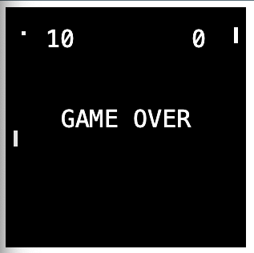

# 🏓 Pong Game (Vanilla JS + Canvas)

A simple Pong game built with HTML5 Canvas and plain JavaScript. Two paddles, a bouncing ball, and a basic AI opponent. First to 10 wins!

## Picture

## 🚀 Features

- Classic Pong gameplay
- Basic AI controlling the left paddle
- User-controlled right paddle (mouse movement)
- Score tracking
- Game over screen at 10 points

## 🛠️ Technologies Used

- HTML5
- CSS3
- JavaScript (Vanilla)
- Canvas API

## 🎮 How to Play

- Move your mouse up and down to control the **right paddle**
- The **left paddle** is controlled by the computer
- Keep the ball in play by hitting it with your paddle
- First to 10 points wins the game

## 📁 File Structure

```
pong/
│
├── index.html         # Canvas container
├── style.css          # Basic styles
└── script.js          # Game logic (the file you shared)
```

## 🧠 Logic Overview

- Ball movement is handled by x/y velocity updates
- Paddle collision checks prevent the ball from passing through
- Bounce angle is slightly adjusted based on collision location
- Game resets ball and updates scores on each miss
- Game ends when a player reaches 10 points

## 💡 Improvements You Can Add

- Sound effects for paddle and wall collisions
- Touch or keyboard controls
- Multiplayer support
- Difficulty levels or smarter AI
- Cool graphics and animations

## 🖥️ Demo

You can run this locally by opening `index.html` in your browser.

